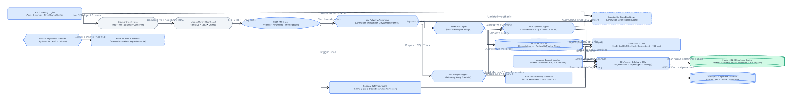

# 🧠 InsightClue — Autonomous AI Data Detective

> **Enterprise Autonomous Root Cause Analysis (RCA) & FinTech Intelligence Multi-Agent Engine**

[](https://www.python.org/)
[](https://github.com/astral-sh/uv)
[](https://github.com/pgvector/pgvector)
[](https://redis.io/)
[](https://github.com/langchain-ai/langgraph)
[](https://fastapi.tiangolo.com/)
[](tests/)

---

## 📌 Executive Summary

Traditional Business Intelligence (BI) dashboards (Tableau, PowerBI) only report **what** happened (*"Corporate Credit Card spend dropped 32% in South Region"*). Data engineers, SREs, and financial analysts then spend days manually running SQL queries across disparate log tables and reading support tickets to determine **why**.

**InsightClue** automates this entire lifecycle as an **Autonomous AI Data Detective**:
1. **Multi-Source Anomaly Ingestion**: Discovers anomalies across both quantitative metrics (14-day Rolling Z-Scores $Z \le -2.5\sigma$, Scikit-Learn **Isolation Forests**) and qualitative customer support outcries (semantic vector clustering).
2. **Autonomous Multi-Agent Investigation (LangGraph)**:
   - **Lead Detective Supervisor**: Formulates root-cause hypotheses and orchestrates specialist investigation tracks.
   - **SQL Analytics Agent**: Executes read-only queries against `payment_gateway_logs` inside a **Safe SQL Sandbox** (AST/regex protection, automatic `LIMIT 50`, timeout).
   - **Vector RAG Agent**: Searches customer complaints using PostgreSQL **`pgvector` cosine similarity (`<=>`)** in 768-dimensional embedding space.
   - **RCA Synthesis Agent**: Correlates machine log evidence with human feedback to calculate confidence scores ($0.0 - 1.0$) and generate actionable mitigation plans.
3. **Real-Time Streaming & Mission Control UI**: Delivers real-time **Server-Sent Events (SSE)** streaming live agent thoughts and rendered RCA markdown reports into an embedded, dark-mode single-page web dashboard.

---

## 🏗️ End-to-End System Architecture



```
                    ┌─────────────────────────────────────────┐
                    │       FinTech Data Stores (Postgres)    │
                    │ (21.8k Metrics, 7.2k Logs, 700 Tickets) │
                    └────────────────────┬────────────────────┘
                                         │
                                         ▼
                    ┌─────────────────────────────────────────┐
                    │       Multi-Source Ingestion Seam       │
                    │  - Rolling Z-Score (Z <= -2.5)          │
                    │  - Isolation Forest (4D Outliers)       │
                    │  - NLP Vector Ticket Outcry Spikes      │
                    └────────────────────┬────────────────────┘
                                         │ (AnomalyEvent Flagged)
                                         ▼
                    ┌─────────────────────────────────────────┐
                    │    Lead Detective Supervisor Agent      │
                    │      (Hypothesis Planner & Router)      │
                    └────────────┬────────────────────────────┘
                                 │
                 ┌───────────────┴───────────────┐
                 ▼                               ▼
  ┌─────────────────────────────┐ ┌─────────────────────────────┐
  │     SQL Analytics Agent     │ │       Vector RAG Agent      │
  │ - Queries `gateway_logs`    │ │ - Queries `dispute_tickets` │
  │ - SafeSQLSandbox (Read-Only)│ │ - pgvector Cosine Search <=>│
  └──────────────┬──────────────┘ └──────────────┬──────────────┘
                 │                               │
                 └───────────────┬───────────────┘
                                 │
                                 ▼
                    ┌─────────────────────────────┐
                    │    RCA Synthesis Agent      │
                    │  - Machine + Human Proof    │
                    │  - Confidence Scoring       │
                    │  - Mitigation Action Plan   │
                    └────────────┬────────────────┘
                                 │
         ┌───────────────────────┴───────────────────────┐
         ▼                                               ▼
┌─────────────────────────────────┐   ┌─────────────────────────────────┐
│     FastAPI REST & SSE Gateway  │   │  Mission Control Web Dashboard  │
│  - GET /api/v1/metrics/overview │   │  - 90-Day Trend Chart.js        │
│  - GET /api/v1/anomalies        │   │  - Filterable Incident Feed     │
│  - GET /investigations/stream/  │   │  - Live Multi-Agent Terminal    │
└─────────────────────────────────┘   └─────────────────────────────────┘
```

---

## 🛠️ Technology Stack & Engineering Highlights

| Layer | Technologies | Architectural Rationale |
| :--- | :--- | :--- |
| **Package Management** | `uv` | Instantaneous dependency resolution and deterministic virtualenv lockfiles. |
| **Database & Vector** | `PostgreSQL 16` + `pgvector` | Unified storage for transactional tables and 768-dim embeddings in a single ACID transaction boundary. |
| **Caching Layer** | `Redis 7` | Sub-millisecond query caching and state storage. |
| **Async ORM** | `SQLAlchemy 2.0 (AsyncIO)` + `asyncpg` | Non-blocking I/O with connection pooling (`pool_size=10, max_overflow=20`), `pool_pre_ping=True`, and `expire_on_commit=False`. |
| **Embeddings** | `Google Gemini Embedding 2` + `FastEmbed` | 768-dimensional native embeddings with automatic offline ONNX fallback. |
| **Anomaly Detection** | `Scikit-learn` + `SciPy` | Rolling 14-day $Z$-scores ($Z \le -2.5$) and multi-dimensional `IsolationForest`. |
| **Multi-Agent Orchestration**| `LangGraph` + `Google Gemini 2.5 Flash` | StateGraph architecture with shared `InvestigationState` blackboard and feedback loops. |
| **AI Safety Guardrail** | `SafeSQLSandbox` | AST and regex validation restricting queries strictly to `SELECT`/`WITH`, forcing `LIMIT 50`, and running in read-only transactions. |
| **Web API & Streaming** | `FastAPI` + `Server-Sent Events (SSE)` | High-performance asynchronous REST endpoints and real-time streaming over standard HTTP. |
| **Frontend UI** | HTML5, Vanilla CSS, JS, `Chart.js`, `Marked.js` | Zero-setup single-page mission control dashboard served directly at `http://localhost:8000/`. |

---

## 📂 Project Directory Structure

```
Major project/
├── docker-compose.yml              # PostgreSQL 16 (pgvector) & Redis 7 containers
├── pyproject.toml                  # uv package & dependency configuration
├── .env.example / .env             # Environment configuration (DB, Redis, Gemini API)
├── reports/                        # Auto-generated executive RCA markdown reports
│   └── rca_104.md
├── src/
│   ├── config/
│   │   └── settings.py             # Strongly-typed Pydantic BaseSettings
│   ├── database/
│   │   ├── base.py                 # DeclarativeBase with auto-timestamping
│   │   └── session.py              # Async connection pool & get_db() dependency
│   ├── models/
│   │   ├── fintech_metrics.py      # DailySpendMetric ORM Model (21,840 rows)
│   │   ├── gateway_logs.py         # PaymentGatewayLog ORM Model (7,280 rows)
│   │   ├── dispute_tickets.py      # DisputeSupportTicket ORM Model (Vector(768))
│   │   └── investigations.py       # AnomalyEvent & InvestigationReport ORM Models
│   ├── services/
│   │   ├── embedding_service.py    # Unified Gemini 2 & FastEmbed engine
│   │   ├── ticket_vector_store.py  # pgvector cosine similarity search repository
│   │   └── anomaly_detector.py     # Rolling Z-Score & Isolation Forest detector
│   ├── agents/
│   │   ├── state.py                # Shared InvestigationState TypedDict blackboard
│   │   ├── llm_client.py           # Unified Gemini 2.5 Flash client with fallback
│   │   ├── tools/
│   │   │   ├── sql_sandbox.py      # Safe Read-Only SQL execution guardrail
│   │   │   └── rag_tool.py         # Dispute ticket semantic retrieval tool
│   │   └── investigation_graph.py  # LangGraph compiled multi-agent state machine
│   ├── api/
│   │   ├── schemas/                # Pydantic v2 request/response contracts
│   │   ├── routes/
│   │   │   ├── metrics.py          # /overview and /timeseries endpoints
│   │   │   ├── anomalies.py        # /anomalies query & /detect trigger
│   │   │   └── investigations.py   # /trigger and /stream real-time SSE endpoints
│   │   └── main.py                 # FastAPI app, CORS, lifespan, and static mount
│   └── static/
│       ├── index.html              # Single-Page Mission Control Dashboard
│       ├── style.css               # Modern dark-mode FinTech design system
│       └── app.js                  # Frontend state, Chart.js, and SSE stream parser
├── scripts/
│   ├── test_db_connection.py       # Diagnostic check for DB, pgvector, and Redis
│   ├── seed_database.py            # Generates 90-day simulation dataset with planted bugs
│   ├── run_anomaly_detection.py    # Batch anomaly detection CLI runner
│   └── run_investigation.py        # End-to-end CLI autonomous RCA investigator
└── tests/
    ├── conftest.py                 # Shared async pytest fixtures & pool cleanups
    ├── test_anomaly_detector.py    # Mathematical & ML anomaly tests
    ├── test_vector_store.py        # pgvector cosine distance & filter tests
    ├── test_multi_agent.py         # SQL sandbox security & LangGraph state tests
    └── test_api.py                 # FastAPI REST & SSE stream tests (16/16 passing)
```

---

## 🚀 Quickstart Guide

### 1. Prerequisites
- **Python 3.11+**
- **Docker Desktop** (running)
- **`uv` package manager**: `curl -LsSf https://astral.sh/uv/install.ps1 | iex` (Windows)

### 2. Configure Environment
```bash
cp .env.example .env
```
*(Optional: Add your `GEMINI_API_KEY` to `.env`. Local FastEmbed and rule-based fallbacks ensure the system runs 100% offline automatically if no key is provided).*

### 3. Start PostgreSQL 16 & Redis Containers
```bash
docker compose up -d
```

### 4. Sync Dependencies
```bash
uv sync
```

### 5. Seed 90-Day FinTech Simulation Dataset
```bash
uv run python scripts/seed_database.py
```
*Populates 21,840 spend metric rows, 7,280 gateway health logs, and 699 pgvector customer support dispute tickets.*

### 6. Run Anomaly Detection Scan
```bash
uv run python scripts/run_anomaly_detection.py
```
*Scans timeseries slices and persists 138 flagged anomaly events into the database.*

### 7. Run CLI Autonomous Investigation
```bash
uv run python scripts/run_investigation.py
```
*Dispatches the LangGraph multi-agent squad, prints live reasoning thoughts, and writes an executive report to `reports/rca_<id>.md`.*

### 8. Launch Web Server & Mission Control Dashboard
```bash
uv run uvicorn src.api.main:app --reload --port 8000
```
- 🖥️ **Web Dashboard**: Open [http://localhost:8000/](http://localhost:8000/)
- 📖 **Interactive Swagger API Docs**: Open [http://localhost:8000/docs](http://localhost:8000/docs)

---

## 🧪 Running the Automated Test Suite

Run all 16 automated tests across the entire stack:
```bash
uv run pytest tests/ -v
```

```
tests/test_anomaly_detector.py::test_anomaly_detection_engine_statistical_and_isolation PASSED
tests/test_anomaly_detector.py::test_anomaly_detector_scan_and_persist_db PASSED
tests/test_api.py::test_health_check_endpoints PASSED
tests/test_api.py::test_metrics_overview_endpoint PASSED
tests/test_api.py::test_metrics_timeseries_endpoint PASSED
tests/test_api.py::test_serve_dashboard_endpoint PASSED
tests/test_api.py::test_list_anomalies_endpoint PASSED
tests/test_api.py::test_get_single_anomaly_endpoint PASSED
tests/test_api.py::test_sse_investigation_stream_endpoint PASSED
tests/test_multi_agent.py::test_sql_sandbox_blocks_destructive_queries PASSED
tests/test_multi_agent.py::test_sql_sandbox_executes_safe_select PASSED
tests/test_multi_agent.py::test_rag_tool_returns_citations PASSED
tests/test_multi_agent.py::test_multi_agent_investigation_state_transition PASSED
tests/test_vector_store.py::test_ticket_vector_store_semantic_search PASSED
tests/test_vector_store.py::test_ticket_vector_store_regional_filter PASSED
tests/test_vector_store.py::test_ticket_vector_store_empty_query PASSED

============================= 16 passed in 25.29s =============================
```

---

## 🎯 Planted Root-Cause Incident Scenarios

The simulation dataset includes realistic planted failure incidents to benchmark the multi-agent squad:

### 1. Partner Bank 3DS OTP Gateway Outage
- **Target**: Days 65–72, `South Region`, `Corporate Credit Card` (`Enterprise Tier`).
- **Telemetry Symptoms**: Authorization rate drops from 98.8% to **79.2%** ($Z \le -20.4\sigma$), daily spend drops 32%, latency spikes to 1,850ms.
- **SQL Machine Proof**: `payment_gateway_logs` reveals over 380 HTTP 504 Gateway Timeouts per day on the HDFC 3DS switch.
- **RAG Human Proof**: Customer tickets confirm: *"3DS OTP never arrived on phone/email... session threw HTTP 504 Gateway Timeout... supplier vendor invoice suspended."*
- **Outcome**: The squad generates an RCA report with **96% confidence** recommending failover to secondary SMS gateways.

### 2. Cross-Border Remittance FX Compliance Hold
- **Target**: Days 80–84, `West Region`, `Cross-Border Remittance`.
- **Telemetry Symptoms**: Chargeback dispute rate spikes to **8.5%**, volume drops 45%.
- **Outcome**: The squad correlates bank currency exchange holds with customer escalation tickets.

---

## 📚 External Benchmarking Datasets (Kaggle & Open FinTech)

To evaluate InsightClue across diverse real-world telemetry, machine logs, and consumer grievances:

| Dataset | Platform & Link | Modality | InsightClue Target Table |
|---|---|---|---|
| **CFPB Consumer Complaints** | [Kaggle Dataset](https://www.kaggle.com/datasets/cfpb/us-consumer-finance-complaints) | NLP Grievance Text | `dispute_tickets` (pgvector cosine search) |
| **PaySim Mobile Money** | [Kaggle Dataset](https://www.kaggle.com/datasets/ealaxi/paysim1) | Transaction Aggregates | `daily_spend_metrics` (Z-Score & Isolation Forest) |
| **IEEE-CIS Fraud Detection** | [Kaggle Competition](https://www.kaggle.com/c/ieee-fraud-detection) | Transaction + Network Logs | `payment_gateway_logs` (SQL Sandbox Queries) |
| **Banking77** | [Hugging Face](https://huggingface.co/datasets/PolyAI/banking77) | Customer Intent Classification | Support RAG Citation & Topic Verification |
| **Numenta Anomaly Benchmark (NAB)** | [Kaggle NAB](https://www.kaggle.com/datasets/boltzmannbrain/nab) | Streaming KPI Time-Series | Anomaly Detection Performance & Early Detection |

---

## 📄 License
MIT License. Built for advanced hands-on AI Engineering & Autonomous Agentic systems mastery.

